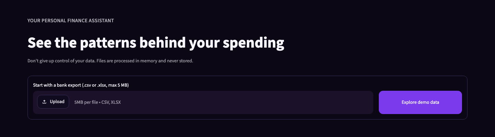
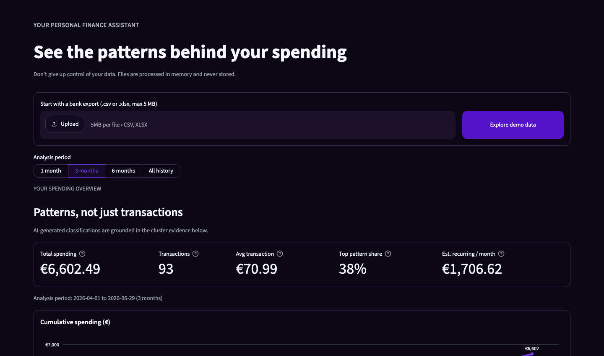
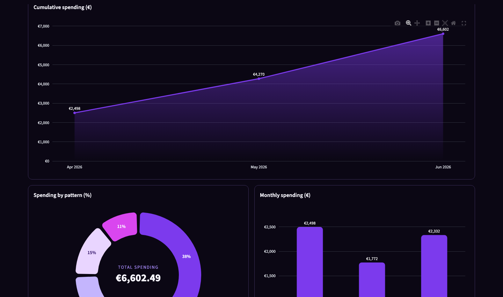
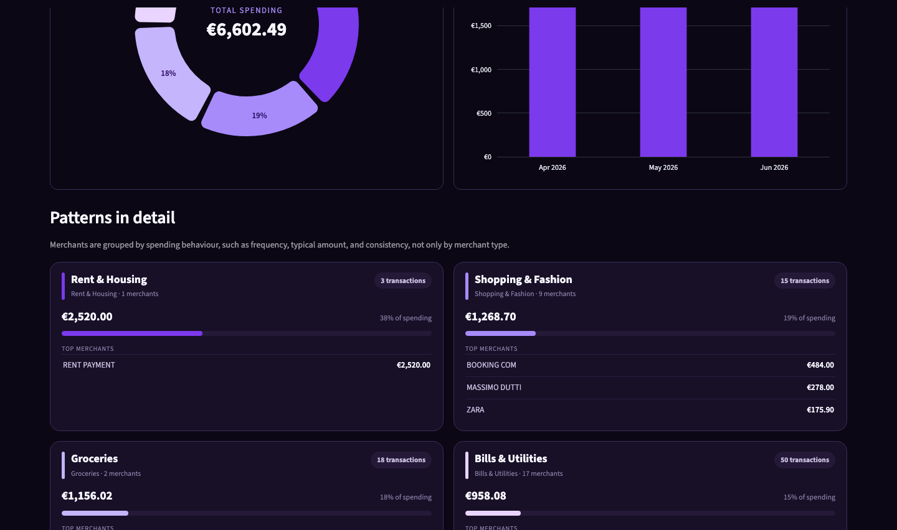
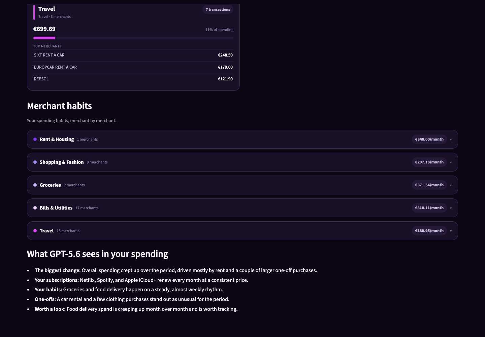

# 💰 AI Personal Finance Assistant

Open the [live app](https://your-ai-personal-finance-assistant.streamlit.app) to explore your spending patterns with an interactive dashboard that turns raw transactions into clear, actionable insights. 



## 🎯 The Problem

Bank statements hide more than they show. They tell you every transaction, but not the story behind your spending. Recurring subscriptions, everyday purchases, and hidden spending patterns are buried in hundreds of line items, making it difficult to understand where your money actually goes.

## 💡 The Solution

AI Personal Finance Assistant transforms raw transaction data into clear spending insights. By combining machine learning with GPT-5.6, it discovers meaningful spending patterns and explains them in plain English, helping you to understand your spending in just a few seconds.

## ✨ Core Features

| Feature | Description |
|---|---|
| **Reveal the habits behind the transactions** | The app identifies up to five spending patterns using frequency, typical amount, timing, and consistency, not merchant names alone |
| **Turn data into a clear story** | GPT-5.6 gives each pattern a meaningful label and writes a plain-English summary |
| **See change over time** | Compare the last month, three months, six months, or your full history without redefining the underlying patterns |
| **Use the app anywhere** | Explore your spending patterns comfortably on a computer, tablet, or mobile phone |
| **Keep your data private** | Files are processed in memory and never stored. AI receives only aggregated pattern evidence. Never raw transaction history |

## 📸 Screenshots

| | |
|---|---|
|  |  |
|  |  |

## 🚀 Quick Start

### Local Development

```bash
# Install dependencies
uv sync --group dev

# Run offline (with mock analysis)
MOCK_LLM=true uv run streamlit run app.py

# Run with GPT-5.6 (requires OPENAI_API_KEY)
OPENAI_API_KEY=sk-... uv run streamlit run app.py
```

Demo data is bundled (`data/spending_demo.csv`). No upload needed to explore.

### Testing

```bash
# Run all 51 tests offline (no OpenAI calls)
MOCK_LLM=true uv run pytest

# Run a specific test
MOCK_LLM=true uv run pytest tests/test_llm.py::test_summary_with_question_rejected -v
```

### Deployed Instance

Visit **[your-ai-personal-finance-assistant.streamlit.app](https://your-ai-personal-finance-assistant.streamlit.app)**. The app redeploys automatically when changes are pushed to `main`. Its `OPENAI_API_KEY` is securely configured in Streamlit Cloud Secrets.

## 🧠 How Codex Contributed to The Final Result

- **Product development.** Codex turned the initial idea into a finished personal-finance product.
- **Engineering.** Codex helped to write and improve the code behind the Streamlit app, and detect the bugs.
- **Accuracy & consistency.** Codex tracked changes across code and documentation, keeping updates synchronized, and reducing the risk of inconsistencies as the project evolved.
- **App design.** Codex supported continuous design iteration across the dashboard layout, charts, responsive desktop/mobile experience.
- **Demo data.** Codex helped to create a realistic demo dataset to showcase features without using sensitive data.
- **Project delivery.** Codex helped to prepare the README, licence, repository structure, etc.

## 🏆 How GPT-5.6 Shaped the Product

- **Pattern label.** GPT-5.6 turns the raw evidence into meaningful labels based on spending frequency, typical amount, and consistency.
- **Spending summary.** GPT-5.6 translates the analysis into five practical insights: the biggest change, subscriptions, recurring habits, one-off expenses, and items worth a closer look.
- **Clear language.** GPT-5.6 presents insights in natural, conversational language instead of technical terminology.
- **Currency-aware results.** GPT-5.6 uses the currency detected from the uploaded statement so amounts are presented in the user’s original currency.
- **Natural merchant names.** GPT-5.6 makes merchant references human-friendly instead of repeating raw bank-statement descriptions.

## 🎥 Demo Video

📺 **[Watch the Demo on YouTube](https://youtu.be/_VLKwRPPVik)**

The demo covers:
- The hidden-spending problem and why it matters
- How Codex was used in the development workflow
- Why pairing statistical clustering with GPT-5.6 is the right approach
- Live walkthrough with synthetic demo data (patterns, spending habits, AI summary)

## 🧩 Built With

**OpenAI GPT-5.6** · **Python 3.11** · **Streamlit** · **Pandas** · **scikit-learn** · **Plotly** · **pytest**

## 📄 License

Copyright © 2026 Olga Aksenova.

The code in this repository is licensed under the **[Apache License, Version 2.0](https://www.apache.org/licenses/LICENSE-2.0)** – see [LICENSE](LICENSE) for the full text.

*Built for OpenAI Build Week · Apps for Your Life*
